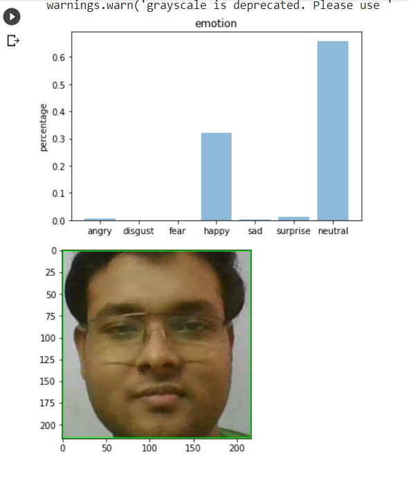

# Depression-Detection-by-Deep-Learning

## About Dataset
The both training and evaluation operations would be handled with Fec2013 dataset. Compressed version of the dataset takes 92 MB space whereas uncompressed version takes 295 MB space. There are 28K training and 3K testing images in the dataset. Each image was stored as 48×48 pixel. The pure dataset consists of image pixels (48×48=2304 values), emotion of each image and usage type (as train or test instance).
